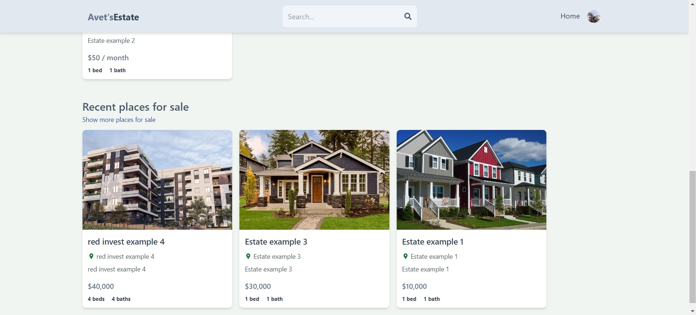
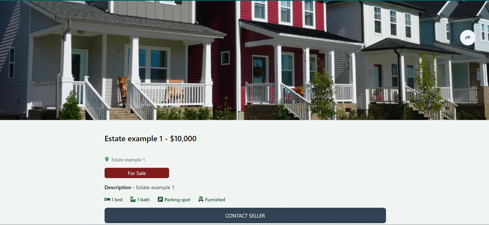
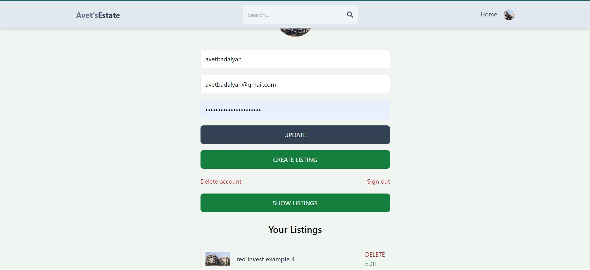
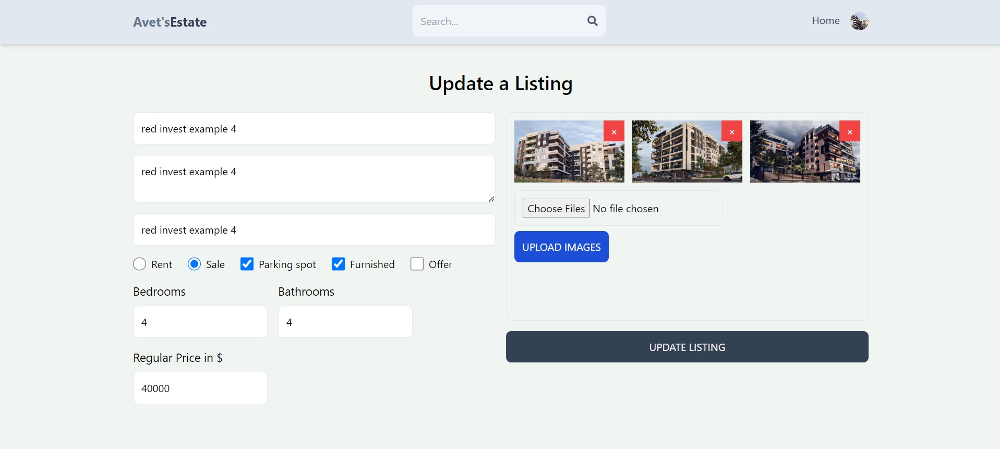

# Avet's Real Estate MERN App

Avet's Real Estate MERN App is a real estate web application where users can discover, search, and list properties for rent or sale. The application allows users to create and manage their own property listings, view detailed information about properties, and authenticate themselves using sign-up and sign-in forms.






## Table of Contents

- [Features](#features)
- [Installation](#installation)
- [Usage](#usage)
- [Routes](#routes)
- [Components](#components)
- [Technologies](#technologies)
- [License](#license)

## Features

- **Home Page:** View recent offers, rentals, and sales.
- **Search:** Search for properties based on various criteria.
- **Property Listing:** View detailed information about properties.
- **User Authentication:** Sign up and sign in to access private routes.
- **Create/Update Listings:** Authenticated users can create and update their property listings.
- **Profile Management:** Users can update their profile information and manage their listings.

## Installation

### Backend

1. Clone the repository:

   ```sh
   git clone https://github.com/AvetBadalyan/MERN-Real-Estate-Project.git
   ```

2. Install backend dependencies:
   ```sh
   npm install
   ```
3. Create a `.env` file in the `root` directory and add the following environment variables:

   ```
   MONGO=<your-mongodb-uri>
   JWT_SECRET=<your-jwt-secret>
   ```

### Frontend

1. Navigate to the frontend directory:
   ```sh
   cd client
   ```
2. Install frontend dependencies:
   ```sh
   npm install
   ```
3. Create a `.env` file in the `client` directory and add the following environment variable:

   ```env
   VITE_FIREBASE_API_KEY=<your-firebase-api-key>

   ```

## Usage

### Backend

1. Start the backend server:
   ```sh
   npm run dev
   ```
   The backend server will start on `http://localhost:3000`.

### Frontend

1. Start the frontend development server:
   ```sh
   cd client
   npm run dev
   ```
   The frontend server will start on `http://localhost:5173`.

### Full Build

1. To build the entire application:
   ```sh
   npm run build
   ```

## Routes

### Backend API Routes

- `POST /api/auth/signup`: User sign-up
- `POST /api/auth/signin`: User sign-in
- `GET /api/properties`: Get all properties
- `POST /api/properties`: Create a new property (authenticated)
- `PUT /api/properties/:id`: Update a property (authenticated)
- `DELETE /api/properties/:id`: Delete a property (authenticated)
- More routes as needed...

### Frontend Routes

- `/`: Home Page
- `/sign-in`: Sign In Page
- `/sign-up`: Sign Up Page
- `/search`: Search Page
- `/listing/:listingId`: Detailed Property Listing Page
- `/profile`: User Profile Page (Private Route)
- `/create-listing`: Create New Listing (Private Route)
- `/update-listing/:listingId`: Update Existing Listing (Private Route)

## Components

### Pages

- **Home:** Displays recent offers, rentals, and sales.
- **Profile:** Shows user profile information and their property listings.
- **Search:** Allows users to search for properties.
- **Listing:** Displays detailed information about a property.
- **AuthForm:** Handles user authentication (sign-in and sign-up).
- **ListingForm:** Allows users to create or update property listings.

### Components

- **PrivateRoute:** A component that checks if the user is authenticated and redirects to the sign-in page if not.
- **OAuth:** A component that handles Google OAuth authentication and dispatches the user information to Redux.
- **ListingItem:** A component that displays the summary of a property listing, including images, price, and details.
- **Header:** A component that includes navigation links, search functionality, and user profile display.
- **Contact:** A component that allows users to contact the seller of a property listing.

## Technologies

### Backend

- **Node.js**: JavaScript runtime for building server-side applications.
- **Express.js**: Web framework for Node.js.
- **MongoDB**: NoSQL database.
- **Mongoose**: ODM for MongoDB.
- **JWT**: JSON Web Token for authentication.
- **bcrypt.js**: Library for hashing passwords.

### Frontend

- **React**: JavaScript library for building user interfaces.
- **Redux**: State management library.
- **React Router**: Library for routing in React applications.
- **Firebase**: Platform for authentication.
- **Tailwind CSS**: Utility-first CSS framework.
- **Vite**: Frontend build tool.

## License

This project is licensed under the ISC License. See the [LICENSE](LICENSE) file for details.

# React + Vite

This template provides a minimal setup to get React working in Vite with HMR and some ESLint rules.

Currently, two official plugins are available:

- [@vitejs/plugin-react](https://github.com/vitejs/vite-plugin-react/blob/main/packages/plugin-react/README.md) uses [Babel](https://babeljs.io/) for Fast Refresh
- [@vitejs/plugin-react-swc](https://github.com/vitejs/vite-plugin-react-swc) uses [SWC](https://swc.rs/) for Fast Refresh
