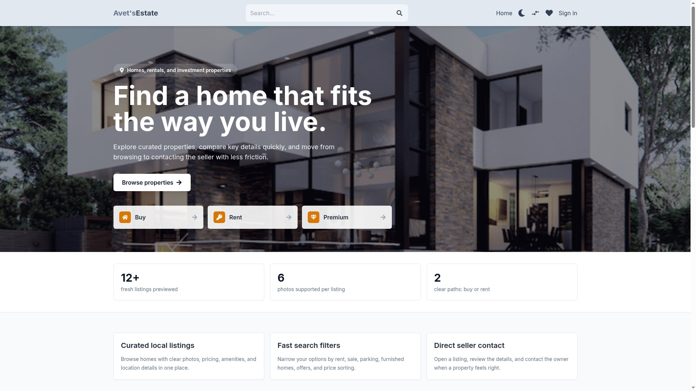
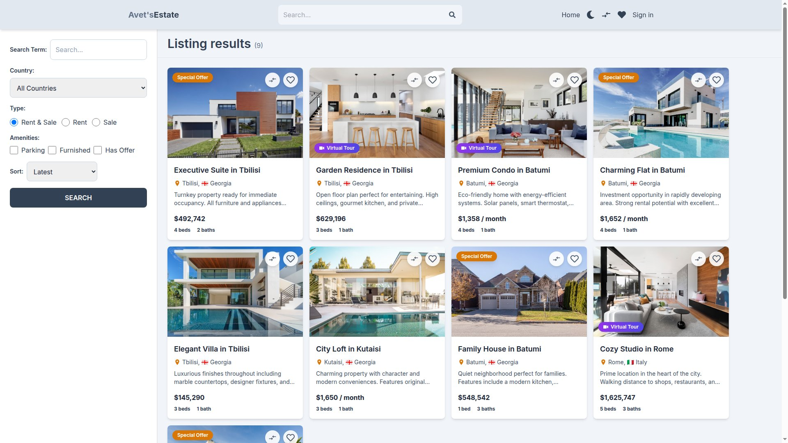
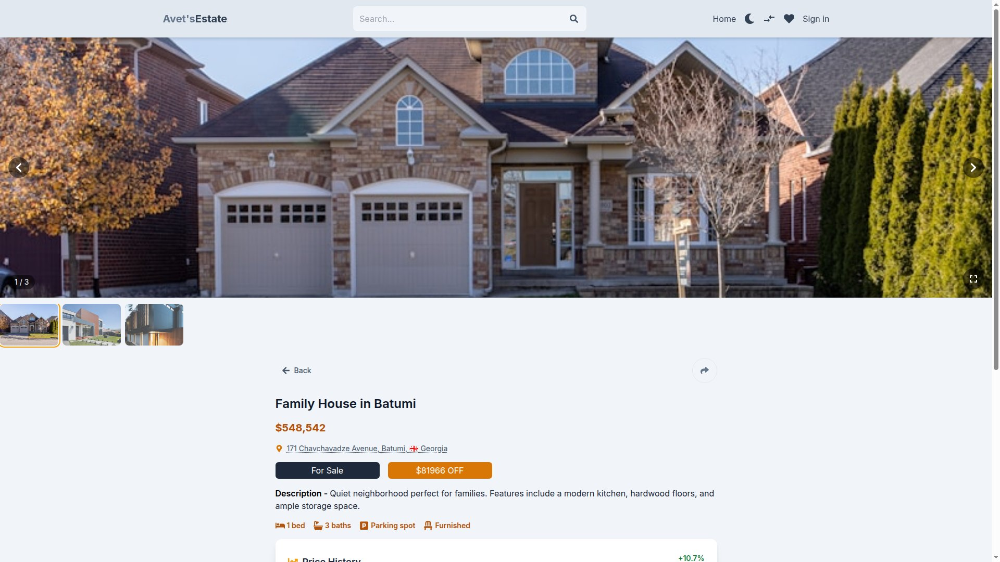
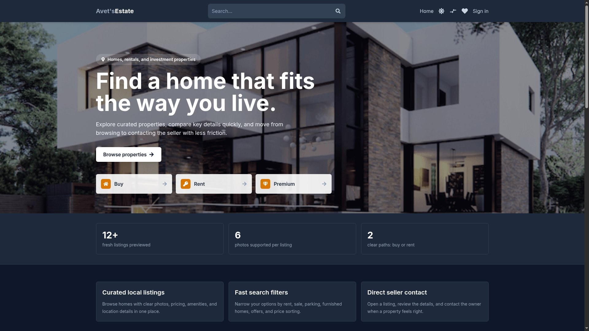
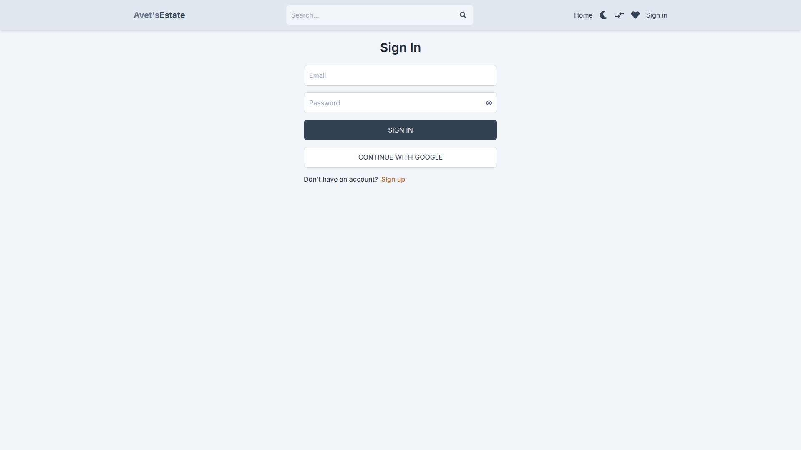
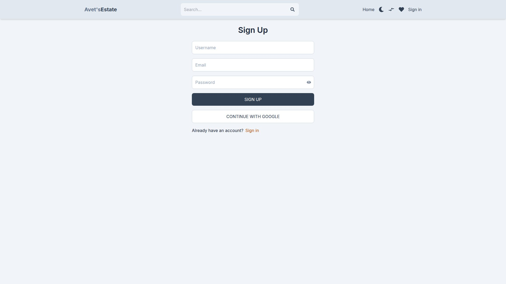

# Avet's Estate

A MERN stack real estate app where users can browse, search, create, update, and delete property listings.

**Live demo:** https://avets-real-estate.vercel.app

## Screenshots

| Home                                                   | Search                                                   | Listing Detail                                            |
| ------------------------------------------------------ | -------------------------------------------------------- | --------------------------------------------------------- |
|  |  |  |

| Dark Mode                                              | Sign In                                                   | Sign Up                                                   |
| ------------------------------------------------------ | --------------------------------------------------------- | --------------------------------------------------------- |
|  |  |  |

## Features

- Browse recent offers, rentals, and sale listings on the home page
- Search listings by keyword, type, country, city, amenities, and sort order
- Filter properties across 10 countries with city-level precision
- Dark mode with system preference detection
- Favorites list (persisted in localStorage)
- Compare up to 3 properties side-by-side
- Listing detail pages with image galleries, price history charts, and mortgage calculator
- Clickable addresses open Google Maps for real location viewing
- Email/password auth and Google sign-in (Firebase Auth)
- Protected profile, create-listing, and update-listing pages
- Authenticated users can create, update, and delete their own listings
- Image uploads via Cloudinary
- Toast notifications for all user actions
- Skeleton loading states for smooth UX
- Responsive design for mobile and desktop

## Tech Stack

**Backend** — Node.js, Express, MongoDB Atlas, Mongoose, JWT, bcryptjs, Cloudinary, multer

**Frontend** — React, Vite, React Router, Redux Toolkit, Redux Persist, Tailwind CSS, React Toastify, Swiper, Recharts, Firebase Auth

## Project Structure

```text
.
├── api/                  # Vercel serverless entry point
├── backend/
│   ├── config/           # DB and Cloudinary config
│   ├── controllers/      # Express route handlers
│   ├── models/           # Mongoose schemas
│   ├── routes/           # API route definitions
│   ├── utils/            # error handler and JWT verification
│   ├── app.js            # Express app
│   └── server.js         # local dev server
├── client/
│   ├── src/
│   │   ├── components/   # shared React components
│   │   ├── pages/        # route pages
│   │   ├── redux/        # Redux store and user slice
│   │   ├── utils/        # image helpers, upload helper
│   │   └── firebase.js   # Firebase app config for Google auth
│   └── vite.config.js    # Vite dev server with API proxy
├── vercel.json           # Vercel deployment config
├── .env.example          # backend env variable template
└── package.json          # root scripts and dependencies
```

## Environment Variables

### Root `.env`

```env
MONGO=<your-mongodb-connection-string>
JWT_SECRET=<your-jwt-secret>
PORT=3000
CLOUDINARY_CLOUD_NAME=<your-cloud-name>
CLOUDINARY_API_KEY=<your-api-key>
CLOUDINARY_API_SECRET=<your-api-secret>
CLIENT_URL=http://localhost:5173
```

### Client `client/.env`

```env
VITE_FIREBASE_API_KEY=<your-firebase-web-api-key>
```

## Running Locally

```bash
# install dependencies
npm install
npm install --prefix client

# start backend (port 3000)
npm run dev

# start frontend (port 5173) in another terminal
npm run dev --prefix client
```

Vite proxies `/api` and `/images` to the backend automatically.

## API Routes

### Auth

```
POST /api/auth/signup
POST /api/auth/signin
POST /api/auth/google
GET  /api/auth/signout
```

### Users

```
GET    /api/user/:id
PUT    /api/user/:id
DELETE /api/user/:id
GET    /api/user/listings/:id
```

### Listings

```
GET    /api/listing
GET    /api/listing/:id
POST   /api/listing
PUT    /api/listing/:id
DELETE /api/listing/:id
```

### Upload

```
POST /api/upload   (multipart, field: image, max 5MB, auth required)
```

## Deployment (Vercel)

1. Import the repo in Vercel
2. Add env variables in the Vercel dashboard (all variables from `.env` above, plus `VITE_FIREBASE_API_KEY`)
3. Set `CLIENT_URL` to your Vercel frontend URL after first deploy
4. Vercel uses `vercel.json` — no extra configuration needed

## License

ISC
